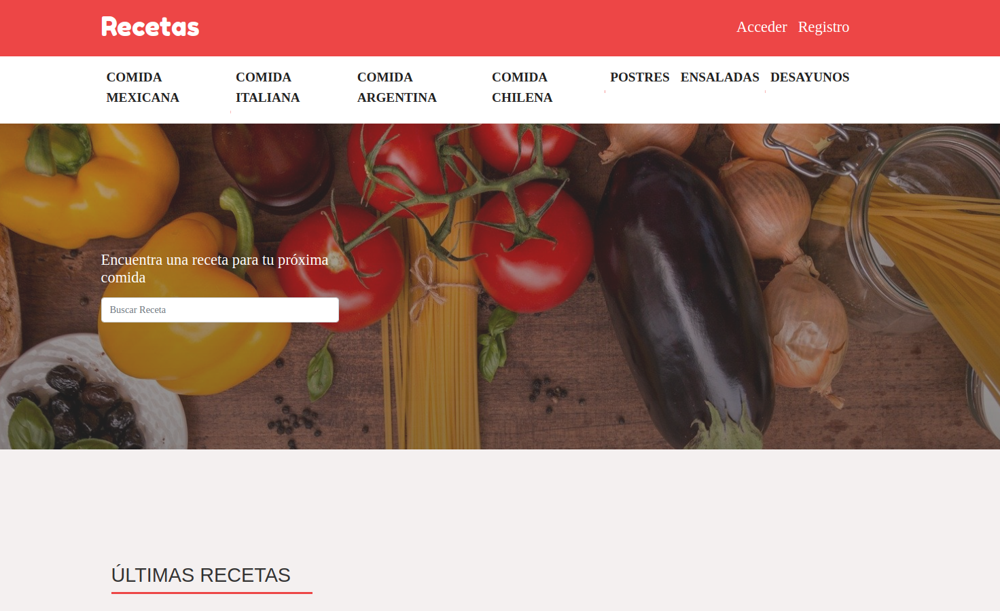

## Resumen

Este es un proyecto , en cual consiste en una plataforma donde , el usuario se podra autenticar, 
crear y votar distintas recetas. El usuario puede crear recetas , elijiendo una categoria.
Tambien habra una logica para los votos el cual sirve "valorar" las recetas mas comentadas...

## RedSocialRecetas




Mas que resolver un problema , es un aporte a la comunidad sobre como , un blog de poder dejar algunas recetas tipicas,
y poder votarlas por distintintas categorias


## Instalación

OS X , Windows y Linux:


```sh

Rename .env.example to .env and fill the options.


composer install
npm install
php artisan key:generate
php artisan migrate
php artisan db:seed
gulp
php artisan serve
```


```sh
edit autoexec.bat
```

## Ejemplo de uso

Algunos casos de ejemplo sobre cómo utilizar tu producto. Algunos bloques de código y capturas de pantalla harán que sea más atractivo.

## Configuración de desarrollo


```sh
Creación y Autenticación de Usuarios

Hash para passwords

Paginación

Subida de Archivos

Seguridad y Protección

Webpack para añadir CSS o Librerías JS

Envio de Emails

Confirmación de Cuentas

Sanitización de Inputs

Con todo esto podrás crear aplicaciones web modernas, pero el curso va más allá, aprenderás otros temas tales como

Integrar Librerías JavaScript con tus aplicaciones Laravel tales como Sweet Alert 2, Dropzone JS, MomentJS y mucho más

Eloquent para relacionar Tablas y crear aplicaciones más robustas y dinamicas

Integrar el framework VueJS en Laravel

Agregar Vue Router y Vuex a Laravel

Crear API's con Laravel que se consumirán con Vue

Agregar Tailwind CSS a tus proyectos

Crear proyectos Full Stack en Laravel

Notificaciones y Middleware


```

## Historial de versiones

* 0.0.1
    * CAMBIO: Actualizada la documentación (el módulo de código permanece igual)


## Meta

Jorge Valdes FLores – (@jorgevaldes47) – jorge.valdes.01@alu.ucm.cl

Distribuido bajo la licencia XYZ. Ver ``LICENSE`` para más información.

[https://github.com/JorgeValdes]


